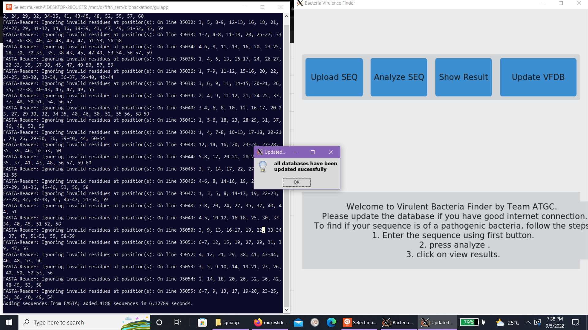
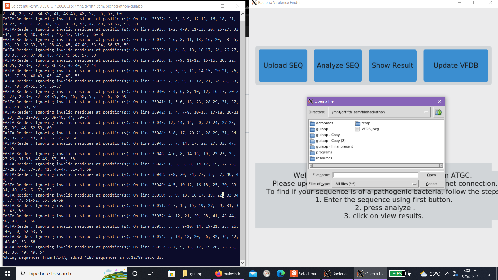
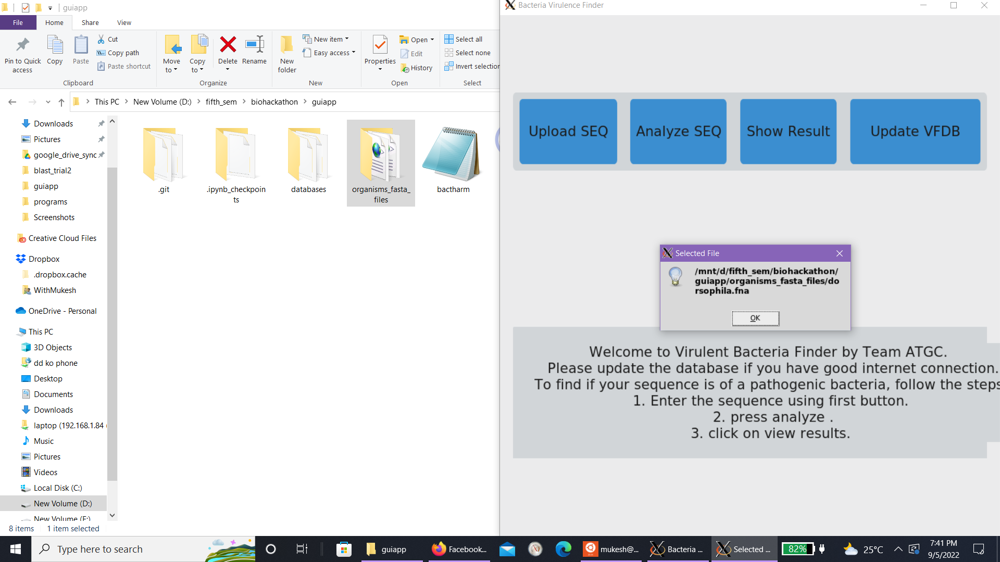
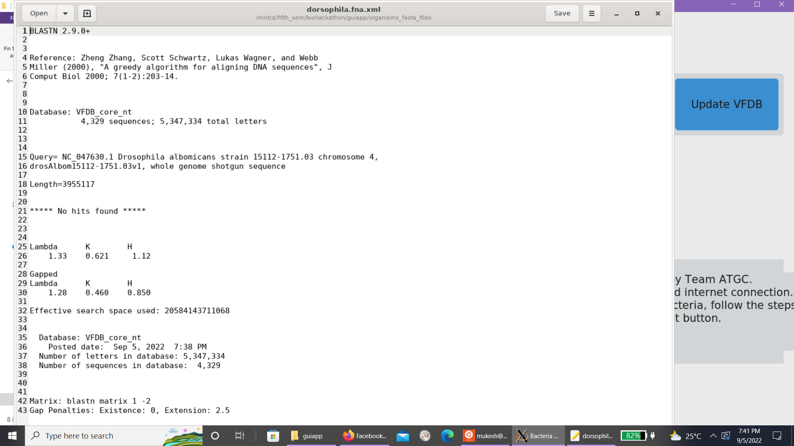

# **Virulent_Bacteria_Finder**
>  An **standalone offline sequence matching application** for nucleotide sequence against the VFDB at http://www.mgc.ac.cn/VFs/ using blast to **identify possibly pathogenic baceria** and their genes causing such pathogenicity. This was made by Team ATGC for Watson Crack the Code-Fest 2022 (Nepal's First Biohackathon) organized by Kathmandu University Biotechnology Creatives (KUBiC) on 4th and 5th sept , 2022.

## Team ATGC:
- **Mukesh Tiwari** , 3rd year , B.Sc. in Computational Mathematics
                          mukeshtiwari200102@gmail.com
- **Astha Pandey** , 3rd year , B.Sc. in Computational Mathematics
asthapandey501@gmail.com

---
## Installation 

### Windows
- Please use winows subsystem for linux(WSL)
- Install ncbi-blast+ before using:
```sh
sudo apt-get install ncbi-blast+
```
- you might need Xming server to get gui display to current screen.
 http://www.straightrunning.com/XmingNotes/

- run Xming and set 
```sh
export DISPLAY=:0.0
```

- Finally download the following python packages:
        - biopython
        - tkinter
        - custontkinter

- to open the program:
```sh
python3 bactharm.py
```

### Ubuntu
- Install ncbi-blast+ before using:
```sh
sudo apt-get install ncbi-blast+
```

- Finally download the following python packages:
        - biopython
        - tkinter
        - custontkinter

- to open the program:
```sh
python3 bactharm.py
```

### Usage:
There are four buttons in the GUI which are explained in the program itself. It will store the result it generates in the same folder as the input fasta file.

To find if your sequence is of a pathogenic bacteria, follow the steps:
1. Enter the sequence using first button. make sure it is in fasta format.
2. Press analyze to perform blastn search against local copy of VFDB.
3. Click on view results to see the results.
4. Click Update db if you want to get the latest copy of VFDB.

> *Feel Free to contact if you have trouble getting it running.* mukeshtiwari200102@gmail.com

## Screen shots.



